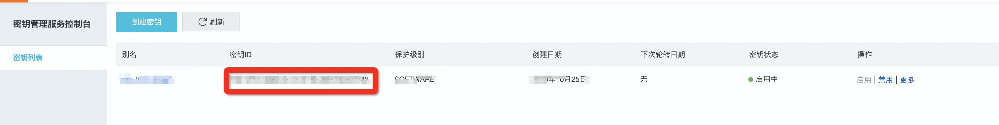

# KMS provider plugin for Alibaba Cloud

[](https://goreportcard.com/report/github.com/AliyunContainerService/ack-kms-plugin)

## Overview

KMS provider plugin for Alibaba Cloud - Enable encryption at rest of Kubernetes secret backed by Alibaba Cloud Key Management Service

## Prerequisites ##

Make sure you have a Kubernetes cluster v1.10+, as you will need the [PR](https://github.com/kubernetes/kubernetes/pull/55684) that added the gRPC-based KMS plugin service. 

## Configurations ##

__From all master nodes:__

1\. Create `/etc/kubernetes/kmsplugin/encryptionconfig.yaml`

if your cluster version is 1.13 or later

```yaml
apiVersion: apiserver.config.k8s.io/v1
kind: EncryptionConfiguration
resources:
  - resources:
    - secrets
    providers:
    - kms:
        name: grpc-kms-provider
        endpoint: unix:///var/run/kmsplugin/grpc.sock
        cachesize: 1000
        timeout: 3s
    - identity: {}
```

__else__ prior version please use the config below:

```yaml
kind: EncryptionConfig
apiVersion: v1
resources:
  - resources:
    - secrets
    providers:
    - kms:
       name: grpc-kms-provider
       cachesize: 1000
       endpoint: unix:///var/run/kmsplugin/grpc.sock
    - identity: {}

```

2\. Replace the following variables in [`k8s-kms-plugin.yaml`](manifests/k8s-kms-plugin.yaml)

* `{{ .Region }}`: alibaba cloud region id, if your cluster deploy on ECS, you can get the value by ```curl http://100.100.100.200/latest/meta-data/region-id```
* `{{ .KeyId }}`: the alibaba cloud KMS key id for secret encryption in KMS service list


**optional**：

The kms plugin support auto periodically pull the Alibaba Cloud STS credentials based on the RAM role from your ECS instance metadata, the STS credentials would be used to request KMS service for 
encryption/decryption.


Before you install the kms plugin, please ensure the target RAM role from ECS instance metadata has been added the required KMS permissions, firstly please login to your master ECS node and curl the URL of instance meta server as this command:

```bash
curl http://100.100.100.200/latest/meta-data/ram/security-credentials/
```

find the target role in RAM console with the name which response from last curl request, and make sure the required KMS policy below has been added. 

```yaml
        {
            "Action": [
                "kms:DescribeKey",
                "kms:Encrypt",
                "kms:Decrypt"
            ],
            "Resource": [
                "*"
            ],
            "Effect": "Allow"
        }
```

you can also configure the AK meta info in the `env` field of plugin manifest as below, if you choose to the AK way, our kms plugin will not pull the STS credentials :

 `{{ .AK }}`and `{{ .AK_Secret }}`: the accesskey and secret of your Alibaba Cloud account, if you using subaccout, please refer to [kms ram auth][kms-ram-auth] to make sure the account has authorized using the required KMS resources.

**Directly configure the RAM AK in pod's env is not a security choice, we recommend to use the STS credential way**：

then move the yaml under `/etc/kubernetes/manifests`, kubelet will create a [static pod][k8s-static-pod] that starts the gRPC service. You should do this on all master nodes, and check all of them running as:

```bash
$ kubectl -n kube-system get po | grep ack-kms-plugin
NAME                                                         READY   STATUS    RESTARTS   AGE
ack-kms-plugin-ap-southeast-1.i-t4n1zao4uxbpl1z3594u   1/1     Running   0          26h
ack-kms-plugin-ap-southeast-1.i-t4nedef2k4kl57kyumey   1/1     Running   0          25h
ack-kms-plugin-ap-southeast-1.i-t4nj9fpimvbhvi27veo2   1/1     Running   0          25h
```

3\. Modify `/etc/kubernetes/manifests/kube-apiserver.yaml` 
Add the following flag:

if your cluster version is 1.13 or later
```yaml
--encryption-provider-config=/etc/kubernetes/kmsplugin/encryptionconfig.yaml
```  

prior version please use
```yaml
--experimental-encryption-provider-config=/etc/kubernetes/kmsplugin/encryptionconfig.yaml
``` 

Mount `/var/run/kmsplugin` and `/etc/kubernetes/kmsplugin` to access the config and socket:

```yaml
...
  volumeMounts:
  - name: kms-sock
    mountPath: /var/run/kmsplugin
  - name: kms-config
    mountPath: /etc/kubernetes/kmsplugin
...
  volumes:
  - name: kms-sock
    hostPath:
      path: /var/run/kmsplugin
  - name: kms-config
    hostPath:
      path: /etc/kubernetes/kmsplugin

```

4\. Wait for apiserver on all master nodes become `Running`

## Verifying ##

Now the cluster should use an envelope encryption scheme to encrypt the secret in etcd with the given key encryption key(KEK) from Alibaba Cloud KMS

1\. Create a new secret

```bash
kubectl create secret generic secret1 -n default --from-literal=mykey=mydata
```

2\. Using etcdctl, read the secret out of the etcd __in the master node__:

ps: the {{.local-ip}} should be replaced by one of the master node ip.

```bash
sudo ETCDCTL_API=3 etcdctl --cacert=/etc/kubernetes/pki/etcd/ca.pem --cert=/etc/kubernetes/pki/etcd/etcd-client.pem --key=/etc/kubernetes/pki/etcd/etcd-client-key.pem --endpoints=https://{{.local-ip}}:2379 get /registry/secrets/default/secret1
```

3\. Verify the stored secret is prefixed with `k8s:enc:kms:v1:grpc-kms-provider` which indicates our kms provider has encrypted the resulting data.

4\. Verify the secret is correctly decrypted:

```bash
kubectl get secrets secret1 -o yaml
```
the output should match `mykey: bXlkYXRh`, which is the encoded data of `mydata`. 


[k8s-static-pod]: https://kubernetes.io/docs/tasks/administer-cluster/static-pod/
[encrypting-config]:https://kubernetes.io/docs/tasks/administer-cluster/kms-provider/#encrypting-your-data-with-the-kms-provider
[kms-ram-auth]:https://help.aliyun.com/document_detail/28953.html
