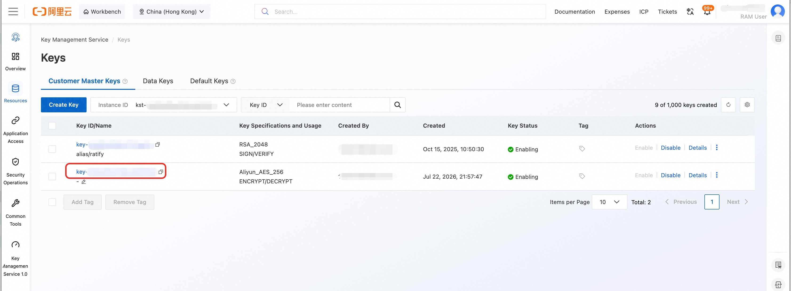

# KMS provider plugin for Alibaba Cloud

[](https://github.com/AliyunContainerService/ack-kms-plugin/actions/workflows/lint.yml)

> **Important**
>
> This project is intended only for the deprecated ACK Dedicated clusters. For the current KMS encryption-at-rest solution used by ACK managed clusters, please refer to [Use KMS to encrypt Kubernetes secrets](https://www.alibabacloud.com/help/en/ack/ack-managed-and-ack-dedicated/security-and-compliance/use-kms-to-encrypt-kubernetes-secrets-2).

## Overview ##

KMS provider plugin for Alibaba Cloud — enable encryption at rest of Kubernetes secrets backed by Alibaba Cloud Key Management Service.

The plugin implements the Kubernetes **KMS v2** gRPC interface (`k8s.io/kms/apis/v2`) by default. It also supports the legacy **v1beta1** interface when explicitly enabled via the `--enable-kms-v1` flag.

## KMS API Version ##

| Mode | Flag | Registered services | Encryption prefix in etcd | Cluster version |
|------|------|---------------------|--------------------------|-----------------|
| **v2-only** (default) | *(none)* | v2 only | `k8s:enc:kms:v2:<name>:` | v1.29+ |
| **Dual** | `--enable-kms-v1` | v1beta1 + v2 | v2 for writes; v1beta1 still readable | v1.27–v1.28 (migration) |
| **Legacy** | `--enable-kms-v1` | v1beta1 + v2 | `k8s:enc:kms:v1beta1:<name>:` | < v1.27 |

- **v2-only**: recommended for all modern clusters (v1.29+). No extra flags needed.
- **Dual**: use during migration from v1beta1 to v2 — both services on the same socket, EncryptionConfiguration has v2 first with v1beta1 as fallback reader.
- **Legacy**: for clusters whose apiserver does not understand `apiVersion: v2` in the KMS provider block — use a v1beta1-only EncryptionConfiguration.

## Prerequisites ##

- Kubernetes **v1.29+** for the v2 encryption configuration (`apiserver.config.k8s.io/v1`).
- Kubernetes **v1.10+** if you also enable the legacy v1beta1 interface with `--enable-kms-v1`.

## Configurations ##

### Step 1: Create the EncryptionConfiguration

On every master node, create `/etc/kubernetes/kmsplugin/encryptionconfig.yaml` — either copy [`manifests/encryption-provider-config.yaml`](manifests/encryption-provider-config.yaml) (v2) or [`manifests/encryption-provider-config-v1beta1.yaml`](manifests/encryption-provider-config-v1beta1.yaml) (legacy).

**v2 (recommended — Kubernetes v1.29+):**

```yaml
apiVersion: apiserver.config.k8s.io/v1
kind: EncryptionConfiguration
resources:
  - resources:
    - secrets
    providers:
    - kms:
        apiVersion: v2
        name: grpc-kms-provider
        endpoint: unix:///var/run/kmsplugin/grpc.sock
        timeout: 3s
    - identity: {}
```

**v1beta1 fallback** (only if the cluster still has v1beta1-encrypted data and the plugin is started with `--enable-kms-v1`):

```yaml
apiVersion: apiserver.config.k8s.io/v1
kind: EncryptionConfiguration
resources:
  - resources:
    - secrets
    providers:
    - kms:
        apiVersion: v2
        name: grpc-kms-provider-v2
        endpoint: unix:///var/run/kmsplugin/grpc.sock
        timeout: 3s
    - kms:
        name: grpc-kms-provider-v1
        endpoint: unix:///var/run/kmsplugin/grpc.sock
        cachesize: 1000
        timeout: 3s
    - identity: {}
```

> **Note:** The v2 provider must appear first so that new secrets are written with the `k8s:enc:kms:v2:` prefix. The v1beta1 provider is kept as a reader so that existing v1beta1-encrypted secrets remain readable. Once all secrets have been re-encrypted (see the [re-encryption procedure](#re-encrypting-existing-secrets)), the v1beta1 provider can be removed.

**Legacy clusters (Kubernetes < v1.27):**

If your cluster's apiserver does not support `apiVersion: v2` in the KMS provider block, use a v1beta1-only configuration. The plugin must be started with `--enable-kms-v1` (see Step 2).

```yaml
apiVersion: apiserver.config.k8s.io/v1
kind: EncryptionConfiguration
resources:
  - resources:
    - secrets
    providers:
    - kms:
        name: grpc-kms-provider
        endpoint: unix:///var/run/kmsplugin/grpc.sock
        cachesize: 1000
        timeout: 3s
    - identity: {}
```

> For Kubernetes **< v1.13**, use the older `EncryptionConfig` (no `apiVersion: apiserver.config.k8s.io/v1`) and the `--experimental-encryption-provider-config` flag instead.

### Step 2: Deploy the KMS plugin static pod

Replace the following variables in [`manifests/k8s-kms-plugin.yaml`](manifests/k8s-kms-plugin.yaml):

| Variable | Description |
|----------|-------------|
| `{{ .Region }}` | Alibaba Cloud region id (auto-detected from ECS metadata at `http://100.100.100.200/latest/meta-data/region-id`) |
| `{{ .KeyId }}` | The Alibaba Cloud KMS key id for secret encryption (in the KMS console, open **Resources** -> **Keys** from the left sidebar menu) |



Place the manifest under `/etc/kubernetes/manifests/` on every master node. The kubelet will create a [static pod][k8s-static-pod] that starts the gRPC service. Verify on all masters:

```bash
$ kubectl -n kube-system get po | grep ack-kms-plugin
ack-kms-plugin-cn-hongkong.192.168.0.109   1/1   Running   0   5m
ack-kms-plugin-cn-hongkong.192.168.0.110   1/1   Running   0   5m
```

> **Legacy clusters (< v1.27):** add `--enable-kms-v1` to the plugin's `command` list so the v1beta1 gRPC service is also registered. Without this flag, the apiserver on old clusters cannot communicate with the plugin.

### Step 3: Configure kube-apiserver

Modify `/etc/kubernetes/manifests/kube-apiserver.yaml` on every master node.

**Add the encryption flag** (in the `command` list):

```yaml
# Kubernetes v1.13+:
--encryption-provider-config=/etc/kubernetes/kmsplugin/encryptionconfig.yaml

# Kubernetes < v1.13 (legacy):
--experimental-encryption-provider-config=/etc/kubernetes/kmsplugin/encryptionconfig.yaml
```

**Add volumes and volume mounts** so the apiserver can read the config and talk to the plugin socket:

```yaml
# In spec.containers[0].volumeMounts:
  - mountPath: /etc/kubernetes/kmsplugin
    name: kmsplugin-config
    readOnly: true
  - mountPath: /var/run/kmsplugin
    name: kmsplugin-socket

# In spec.volumes:
  - hostPath:
      path: /etc/kubernetes/kmsplugin
      type: Directory
    name: kmsplugin-config
  - hostPath:
      path: /var/run/kmsplugin
      type: Directory
    name: kmsplugin-socket
```

### Step 4: Wait for apiserver restart

The kubelet will detect the manifest change and restart the apiserver on each master node. Wait for all apiservers to become `Running` and verify with `kubectl get --raw /readyz` (should return `ok`).

## Credentials ##

The plugin supports two credential modes. **STS credentials via RAM role (recommended)** is the default.

### STS credentials (recommended)

The plugin automatically pulls STS credentials from the ECS instance metadata service. No env vars are required — just ensure the master node's RAM role has the KMS permissions below.

Check the RAM role name:

```bash
curl http://100.100.100.200/latest/meta-data/ram/security-credentials/
```

Then attach the following policy to that role in the RAM console:

```json
{
    "Action": [
        "kms:DescribeKey",
        "kms:Encrypt",
        "kms:Decrypt"
    ],
    "Resource": ["*"],
    "Effect": "Allow"
}
```

### Static Access Key (not recommended)

You may set the AK directly in the plugin pod's env, but **this is not a secure practice**:

| Env var | Description |
|---------|-------------|
| `ACCESS_KEY_ID` | Alibaba Cloud access key id |
| `ACCESS_KEY_SECRET` | Alibaba Cloud access key secret |

When static AK is provided the plugin skips STS credential refresh. Ensure the account has the KMS permissions listed above (see [RAM authorization][kms-ram-auth]).

## Parameters ##

### Command-line flags

| Flag | Default | Description |
|------|---------|-------------|
| `--key-id` | *(required)* | Alibaba Cloud KMS key id used for encryption/decryption |
| `--path-to-unix-socket` | `/var/run/kmsplugin/socket.sock` | Full path to the Unix socket for communicating with kube-apiserver |
| `--enable-kms-v1` | `false` | Register both v1beta1 and v2 KMS gRPC services on the same socket. Required for legacy clusters (< v1.27) and during v1beta1-to-v2 migration. When `false` (default), only v2 is registered |
| `--gloglevel` | `0` | glog verbosity level (e.g. `5` for verbose debug logging) |

### Environment variables

| Variable | Default | Description |
|----------|---------|-------------|
| `ACK_KMS_REGION_ID` | *(auto from ECS metadata)* | Alibaba Cloud region id. Falls back to instance metadata if unset |
| `ACK_KMS_DOMAIN` | `kms-vpc.%s.aliyuncs.com` | KMS API domain. `%s` is replaced by the region id |
| `CREDENTIAL_INTERVAL` | `480` | Interval in seconds between STS credential refresh cycles (max 1799) |
| `ACCESS_KEY_ID` | *(empty)* | Static access key id (disables STS refresh when set) |
| `ACCESS_KEY_SECRET` | *(empty)* | Static access key secret |

### Health subcommand

```bash
ack-kms-plugin health --path-to-unix-socket=/var/run/kmsplugin/grpc.sock
```

The health check calls the v2 `Status` RPC first. If the server does not implement v2 (legacy mode), it falls back to the v1beta1 `Version` RPC. Exit code 0 = healthy.

## Verifying ##

After the apiserver restarts, the cluster uses envelope encryption to encrypt secrets in etcd with the configured KMS key.

1\. Create a new secret:

```bash
kubectl create secret generic secret1 -n default --from-literal=mykey=mydata
```

2\. Read the raw secret from etcd **on a master node**:

> Replace `{{.local-ip}}` with the master node's IP address.

```bash
sudo ETCDCTL_API=3 etcdctl \
  --cacert=/etc/kubernetes/pki/etcd/ca.pem \
  --cert=/etc/kubernetes/pki/etcd/etcd-client.pem \
  --key=/etc/kubernetes/pki/etcd/etcd-client-key.pem \
  --endpoints=https://{{.local-ip}}:2379 \
  get /registry/secrets/default/secret1
```

3\. Verify the stored value starts with `k8s:enc:kms:v2:grpc-kms-provider:` (v2 encryption), which confirms the KMS provider has encrypted the data at rest.

4\. Verify the secret can be decrypted:

```bash
kubectl get secrets secret1 -o yaml
```

The output should show `mykey: bXlkYXRh`, which is the base64-encoded value of `mydata`.

## Re-encrypting existing secrets ##

After enabling KMS encryption (or switching from v1beta1 to v2), existing secrets remain in their previous format until rewritten. To re-encrypt all secrets cluster-wide:

```bash
kubectl get secrets --all-namespaces -o json | kubectl replace -f -
```

This triggers the apiserver to re-write each secret using the current (first) encryption provider. After completion, all secrets in etcd will use the `k8s:enc:kms:v2:` prefix.

[k8s-static-pod]: https://kubernetes.io/docs/tasks/administer-cluster/static-pod/
[encrypting-config]: https://kubernetes.io/docs/tasks/administer-cluster/kms-provider/#encrypting-your-data-with-the-kms-provider
[kms-ram-auth]: https://help.aliyun.com/document_detail/28953.html
